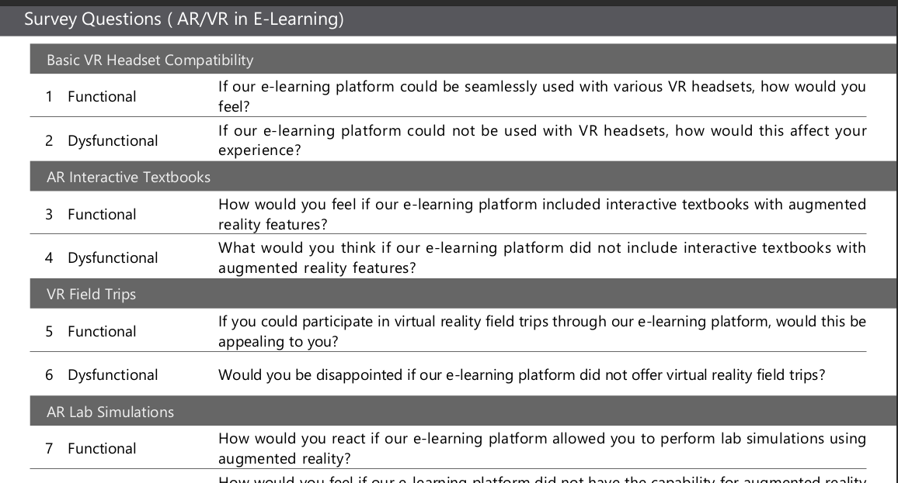
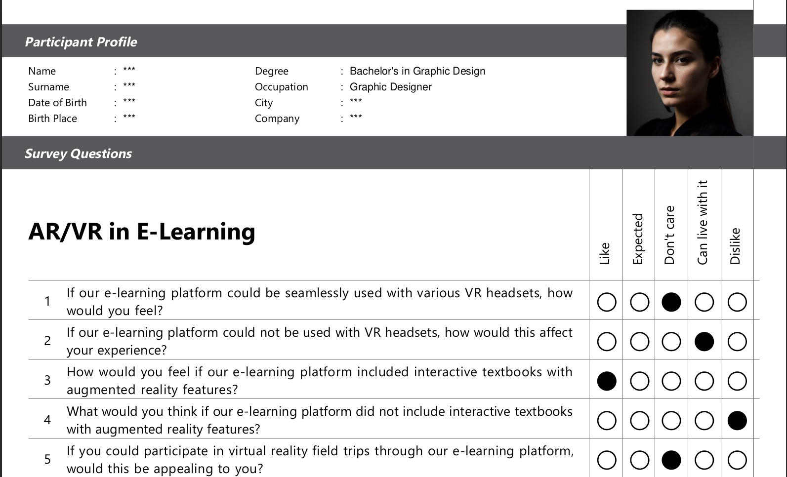
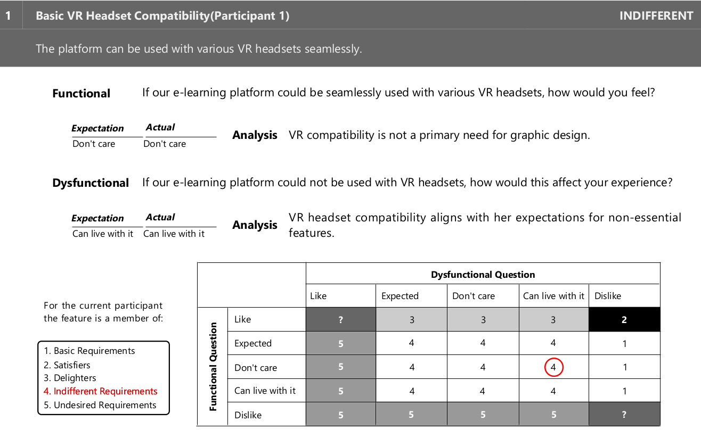
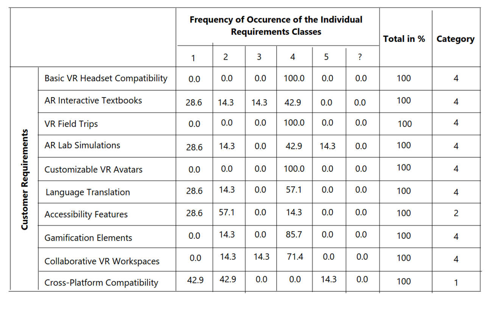

# ChatGPT and Generative AI for Acquiring Feature Category Candidate Results
This is the companion deliverable and outputs repository for my related post at [retrocognito.medium.com](https://retrocognito.medium.com/chatgpt-and-generative-ai-for-acquiring-feature-category-candidate-results-part-i-general-process-87462eb8dd5e)
 
 The repository contains:
 - Survey Questions (pdf)
  
 - Survey Responses (pdf)
 
 - Survey Analysis (pdf)
  
 
 - Survey Results (pdf)
  

 - related images (roster, character evolution, individual character image iterations)
    
 